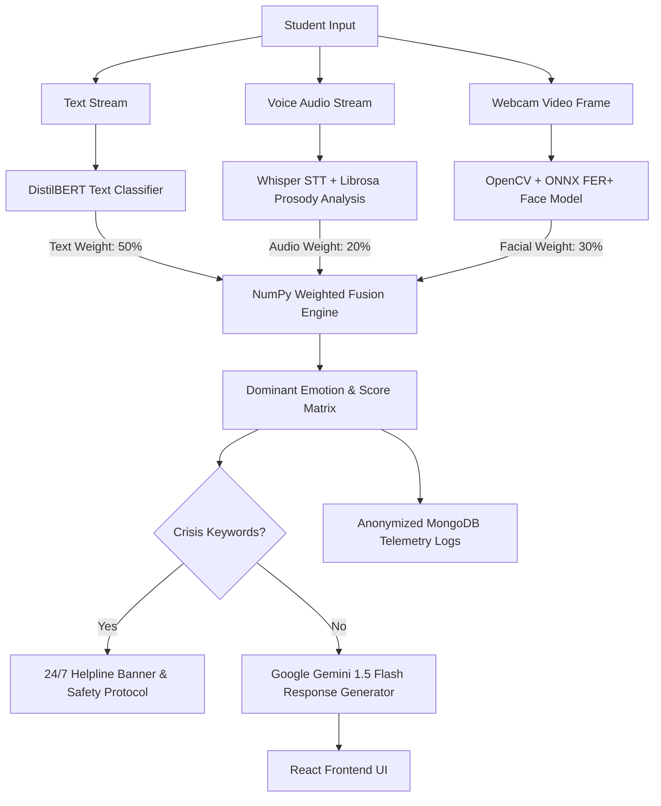

<div align="center">

# 🧠 Project Empath

### *Culturally-Tailored, Institution-Integrated Digital Mental Health & Psychological Support System for Higher Education*

[](https://python.org)
[](https://flask.palletsprojects.com/)
[](https://react.dev)
[](https://vitejs.dev)
[](https://tailwindcss.com)
[](https://mongodb.com)
[](https://ai.google.dev/)

<p align="center">
  <a href="#-the-5-core-pillars">Core Pillars</a> •
  <a href="#-architecture">Architecture</a> •
  <a href="#-tech-stack">Tech Stack</a> •
  <a href="#-getting-started">Getting Started</a> •
  <a href="#-repository-structure">Structure</a>
</p>

---

</div>

## 📌 Executive Summary

**Project Empath** is a comprehensive, culturally-contextualized digital mental health platform built specifically for Indian higher education institutions. It bridges the critical gap between college students suffering in silence and campus support systems.

By combining **multimodal AI emotion triage (Facial + Vocal Prosody + Text)** with **confidential counsellor booking**, **regional self-care toolkits**, **moderated anonymous peer support**, and **real-time institutional analytics for college leadership**, Empath transforms campus wellness from reactive crisis management to proactive care.

---

## 🏛️ The 5 Core Pillars

| Pillar | Title | Description | Target Impact |
| :--- | :--- | :--- | :--- |
| **Pillar 1** | **AI-Guided First-Aid Triage** | 24/7 empathetic multimodal companion powered by Google Gemini 1.5 Flash. Fuses face, speech, and text emotion streams with crisis keyword detection. | Instant, stigma-free 24/7 first response. |
| **Pillar 2** | **Confidential Counsellor Booking** | Private digital bridge linking students directly to campus psychological counsellors without public clinic visits. | Eliminates social stigma in seeking care. |
| **Pillar 3** | **Psychoeducational Resource Hub** | Culturally tailored self-care toolkits, 5-4-3-2-1 grounding, and audio relaxations in **English, Hindi (हिंदी), and Marathi (मराठी)**. | Empowers self-regulation for exam/placement stress. |
| **Pillar 4** | **Moderated Peer Forum** | Safe anonymous venting community where students share experiences under creative aliases with active safety keyword moderation. | Fosters peer solidarity and shared coping. |
| **Pillar 5** | **Institutional Admin Dashboard** | Aggregated, anonymized well-being telemetry empowering Deans and IQAC committees to deploy targeted wellness policies. | Data-driven institutional decision making. |

---

## 🏗️ Architecture & Multimodal Fusion Engine

Empath employs a parallel multi-stream architecture to capture and synthesize subtle emotional cues across three independent modalities:



---

## 💻 Tech Stack

### **Backend (API & AI Engine)**
- **Framework**: Flask 3.0 + Flask-SocketIO 5.3 + Eventlet / Gevent
- **Language Models**: Google Gemini 1.5 Flash API (`google-generativeai`)
- **Emotion Classifiers**: HuggingFace Transformers (`DistilBERT`), ONNX Runtime (`emotion-ferplus-8.onnx`), OpenCV (`HaarCascade`)
- **Audio Processing**: OpenAI Whisper (`small`), Librosa (`MFCC` & `Chroma` feature extraction)
- **Database**: MongoDB (Local WiredTiger instance / MongoDB Atlas) with `PyJWT` authentication

### **Frontend (User Interface)**
- **Framework**: React 19 + Vite 7 + React Router DOM 7
- **Styling**: Tailwind CSS v4 + Vanilla Glassmorphism UI & Micro-animations
- **Real-Time Communication**: `socket.io-client` (WebSockets)
- **Iconography**: Lucide React

---

## 🚀 Getting Started

### Prerequisites
- **Python**: `3.10` or higher
- **Node.js**: `v18.0.0` or higher
- **MongoDB**: Running locally on `127.0.0.1:27017` or Atlas connection URI

---

### 1️⃣ Clone & Configure Environment

```bash
git clone https://github.com/AadiBurande/Project-empath.git
cd Project-empath
```

Create a `.env` file in the root directory:

```env
GEMINI_API_KEY="your_google_gemini_api_key_here"
JWT_SECRET_KEY="empath_jwt_secret_key_2026"
MONGODB_URI="mongodb://127.0.0.1:27017/empath_db"
```

---

### 2️⃣ Run Backend Server (Port 5000)

```bash
cd Backend
python -m pip install -r requirements.txt
python main.py
```
> *Backend server will run at `http://localhost:5000` in API mode.*

---

### 3️⃣ Run Frontend Web Application (Port 5173)

In a separate terminal window:

```bash
cd Frontend
npm install
npm run dev
```
> *Open `http://localhost:5173` in your browser.*

---

## 📂 Repository Structure

```
Project Empath/
├── Backend/                    # Python Flask + Socket.IO API & AI Engine
│   ├── app/                    # 5 Pillar REST & Socket.IO Route Blueprints
│   │   ├── admin.py            # Pillar 5: Institutional Analytics Engine
│   │   ├── api.py              # Core Flask-SocketIO Server & Telemetry
│   │   ├── auth.py             # User Auth & JWT Token Verification
│   │   ├── booking.py          # Pillar 2: Confidential Counsellor Booking API
│   │   ├── community.py        # Pillar 4: Anonymous Peer Support Forum API
│   │   └── resources.py        # Pillar 3: Psychoeducational Hub API
│   ├── core/                   # Multimodal AI Engine Modules
│   │   ├── audio_analyzer.py   # Librosa MFCC Prosody Analysis
│   │   ├── facial_analyzer.py  # OpenCV ONNX FER+ Face Expression Classifier
│   │   ├── fusion_engine.py    # 3-Modality Weighted Emotion Fusion
│   │   ├── response_generator.py # Google Gemini 1.5 Flash Response Generator
│   │   ├── text_analyzer.py    # Whisper Speech-To-Text & Emotion Classifier
│   │   └── therapist_service.py # Google Places & Therapist Integration
│   ├── models/                 # Pre-trained Model Binaries & Weights
│   ├── config.py               # Centralized Configuration & Helpline Directory
│   ├── main.py                 # Backend Server Entrypoint (Headless API on Port 5000)
│   └── requirements.txt        # Python Dependencies
│
├── Frontend/                   # Modern Vite + React + Tailwind v4 Web Application
│   ├── src/
│   │   ├── components/         # Header, Sidebar, Footer, Webcam Feed, Cards
│   │   ├── contexts/           # AuthContext (JWT State & User Persistence)
│   │   ├── pages/              # 5 Pillar Pages (Chat, Booking, Resources, Forum, Admin, Auth)
│   │   ├── utils/              # API Fetch Wrapper
│   │   ├── App.jsx             # React Router DOM Setup & Route Guards
│   │   ├── main.jsx            # React Entrypoint
│   │   └── index.css           # Tailwind Imports
│   ├── package.json            # Node Dependencies
│   └── vite.config.js          # Vite Bundler Config
│
├── Database/                   # Local MongoDB Storage Folder
├── .env                        # Root Environment Variables (GEMINI_API_KEY)
├── .gitignore
└── README.md                   # Project Documentation
```

---

## 🔒 Security & Crisis Protocols

> [!IMPORTANT]
> **Crisis Interventions**: Empath is designed with a strict safety-first policy engine. Whenever crisis keywords (e.g., suicide, self-harm, severe hopelessness) are detected in any input stream:
> 1. The system immediately embeds verified 24/7 helplines (**AASRA: 9820466726**, **iCall: 9152987821**, **Vandrevala Foundation: 9999 666 555**).
> 2. Flags community posts for administrator review without compromising student identities.
> 3. Does **not** store personally identifiable session transcripts.

---

## 🤝 Contributing & License

Contributions are welcome! Please feel free to submit a Pull Request or open an Issue.

Distributed under the **MIT License**. See `LICENSE` for more information.

<div align="center">
  <sub>Built with ❤️ for Indian Higher Education Mental Health Wellness</sub>
</div>
